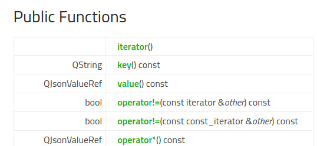

== Ассоциативные контейнеры Qt
* QHash
* QMap
* QJsonObject

== `QJsonObject::iterator`

[%notitle]
== Адаптер `QJsonObject::iterator`
[source,c++,linenums,highlight='|5|6,12..13|7,9..10']
----
include::../test/assoc_containers.cpp[tag=iter_begin]
include::../test/assoc_containers.cpp[tag=iter_star]
----

[%notitle]
== Используем адаптер `QJsonObject::iterator`
[source,c++,linenums]
----
include::../test/assoc_containers.cpp[tag=use]
----
