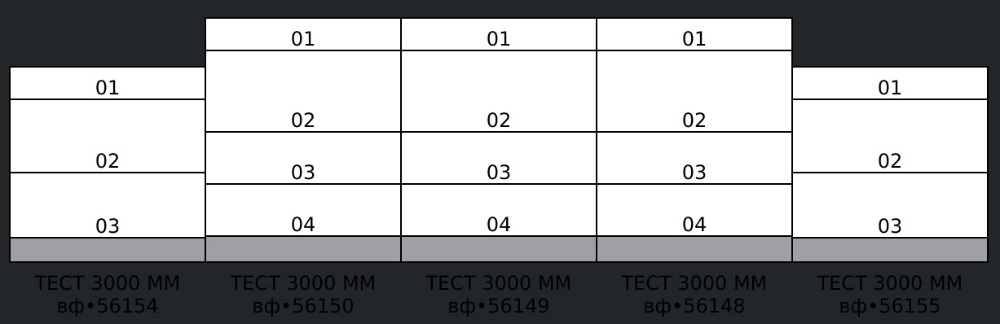

== Редактор Торгового Зала
* Разрабатывается с 2012-го года
* Использует Qt 5 для создания GUI
* На текущий момент собирается с поддержкой {cpp}17

[%notitle]
== Скрин редактора 1

[.stretch]

[%notitle]
== Скрин редактора 2

[.stretch]

[%notitle]
== Скрин редактора 3

[.stretch]

== Задача: вычисление погонного метража оборудования
[source,c++,linenums]
----
include::../test/running_meter.cpp[tag=shelf_def]
----

== Новая задача
Вычисление погонного метража оборудования в пределах границ.

[source,c++,linenums]
----
include::../test/running_meter.cpp[tag=meter_bounded]
----

[%notitle.columns.smaller]
== Сравнение двух функций

[.column]
--
[source,c++,linenums]
----
include::../test/running_meter.cpp[tag=alt1]
----
--

[.column]
--
[source,c++,linenums]
----
include::../test/running_meter.cpp[tag=alt1_bounded]
----
--

//
[%notitle.columns.smaller]
== Сравнение двух функций (c выделением)

[.column]
--
[source,c++,linenums,highlight=7..13]
----
include::../test/running_meter.cpp[tag=alt1]
----
--

[.column]
--
[source,c++,linenums,highlight=7..13]
----
include::../test/running_meter.cpp[tag=alt1_bounded]
----
--

[.columns]
== `std::accumulate`

[.column]
--
[source,c++,linenums]
----
include::../test/running_meter.cpp[tag=alt2]
----
--

[.column]
--
[source,c++,linenums]
----
include::../test/running_meter.cpp[tag=alt2_bounded]
----
--

[.columns]
== `boost::accumulate`

[.column]
--
[source,c++,linenums]
----
include::../test/running_meter.cpp[tag=alt3]
----
--

[.column]
--
[source,c++,linenums]
----
include::../test/running_meter.cpp[tag=alt3_bounded]
----
--

[.columns]
== `boost::adaptors::transformed`

[.column]
--
[source,c++,linenums]
----
include::../test/running_meter.cpp[tag=alt4]
----
--

[.column]
--
[source,c++,linenums]
----
include::../test/running_meter.cpp[tag=alt4_bounded]
----
--
